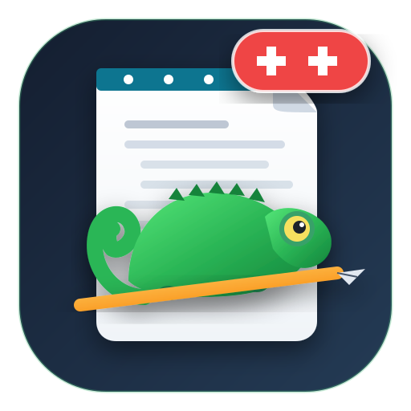

# 🦎 Notepad++ Web Edition 🚀
### *The Ultimate Modern Browser-Based Clone of Notepad++ Powered by Monaco Editor & GitHub Copilot*

<p align="center">
  
</p>

<p align="center">
  <a href="#-key-features"></a>
  <a href="#-tech-stack"></a>
  <a href="#-ai-copilot-integration"></a>
  <a href="#-pwa-offline-support"></a>
  <a href="#-license"></a>
</p>

---

## 🌟 Overview

**Notepad++ Web Edition** is a faithful, lightning-fast web implementation of the world's most beloved text and source code editor. Built for modern developers who crave the speed, utilitarian simplicity, and nostalgia of Notepad++, enhanced with modern cloud-grade superpowers: **Monaco Editor**, **GitHub Copilot inline intelligence**, **multi-tab workspace memory**, and **PWA offline capability**.

---

## ✨ Key Features

### 💻 1. The Classic Notepad++ Experience
* 🗂️ **Multi-Tab Document Editing**: Seamlessly open, edit, reorder, clone, and close multiple documents.
* 🌓 **Split Dual View**: Side-by-side dual-pane editing (`Ctrl+Alt+S`) for comparing and working across files.
* 📂 **Drag & Drop File Loading**: Drag any files or code snippets directly from your desktop into the app.
* 💾 **Persistent Auto-Save**: Your open tabs and workspace state survive browser restarts and page refreshes.
* 🎨 **Authentic Themes**:
  - 🏛️ **Notepad++ Classic** (nostalgic Windows XP / 7 style)
  - 🌙 **Notepad++ Dark**
  - 🌌 **VS Dark**
  - 🌋 **Monokai**
  - 🧛 **Dracula**
  - ☀️ **GitHub Light**
* 🔍 **Advanced Find & Replace Modal**: Whole Word, Match Case, Regex Search, In Selection, and Occurrence Counting.
* ⚡ **Line Endings & Encodings**: Switch on the fly between **CRLF (Windows)** and **LF (Unix)**, plus UTF-8, UTF-16, ASCII, and ISO encodings.

---

### 🤖 2. GitHub Copilot & AI Code Assistant
* ⚡ **Inline Copilot Prompt Bar (`Ctrl+I` / `Alt+\`)**:
  - Docks smoothly above the active editor pane.
  - Ask Copilot in plain English to write, refactor, or debug code on the spot.
* 📚 **Workspace-Aware Context**:
  - **Single Document Mode**: Deeply analyze the active open document or selected text.
  - **All Open Tabs Mode**: Cross-reference all open documents across your workspace (e.g. types, styles, imports).
* 🎯 **Zero-Manual-Copy 1-Click Actions**:
  - ⚡ **Insert at Cursor / Replace Selection**: Direct Monaco injection with native `Ctrl+Z` Undo support.
  - 🔄 **Replace File Content**: Replaces active document content in one click.
  - 💾 **Save to New Tab**: Automatically creates a new tab with the generated code and auto-detected language.
  - 📥 **Direct Download**: Instantly downloads code as a local file to disk without copying.
  - 📋 **Copy to Clipboard**: Quick copy with real-time visual feedback.
* 🧠 **Supported AI Engines**:
  - 🌟 **Google Gemini**: Powered by ultra-fast `gemini-2.5-flash`, `gemini-3.8-flash`, and `gemini-3.1-pro`.
  - 🌐 **OpenRouter Free Router**: Connect to free high-intelligence models (`openrouter/free`, `qwen/qwen3.8-27b:free`, `nvidia/nemotron-3.5-lightning:free`, and more).

---

### 📱 3. Offline PWA & Mobile Optimization
* 📶 **100% Offline Capability**: Runs seamlessly offline via Service Workers and Cache Storage.
* 📲 **Installable Desktop/Mobile App**: Install directly from the toolbar or browser prompt as a native PWA app.
* ⌨️ **Mobile Quick-Access Bar**: Dedicated touch buttons for brackets `{}`, `[]`, quotes `""`, tabs, and undo/redo.

---

## 🛠️ Tech Stack

| Technology | Purpose |
| :--- | :--- |
| **React 18** | High-performance reactive UI architecture |
| **TypeScript** | Type safety across entire client and server |
| **Monaco Editor** | The VS Code editor engine powering syntax and text manipulation |
| **Tailwind CSS** | Authentic Windows classic and dark styling with responsive design |
| **Vite** | Blazing-fast build tooling and asset compilation |
| **Express & Node.js** | Server-side proxy for secure AI code generation and streaming |
| **@google/genai SDK** | Official Google GenAI SDK for Gemini model integration |
| **Lucide Icons** | Pixel-perfect modern icons matching classic Notepad++ controls |

---

## ⌨️ Keyboard Shortcuts Cheat Sheet

| Shortcut | Description |
| :--- | :--- |
| **`Ctrl + I`** or **`Alt + \`** | 🤖 **Open GitHub Copilot Inline Prompt** |
| **`Ctrl + Shift + A`** | 💬 **Toggle AI Assistant Drawer** |
| **`Ctrl + N`** | 📄 Create New Document |
| **`Ctrl + O`** | 📂 Open Local File Picker |
| **`Ctrl + S`** | 💾 Save Current Document |
| **`Ctrl + Shift + S`** | 🗄️ Save All Open Documents |
| **`Ctrl + W`** | ❌ Close Active Tab |
| **`Ctrl + F`** | 🔍 Find in Document |
| **`Ctrl + H`** | 🔁 Replace in Document |
| **`Ctrl + Alt + S`** | 🌓 Toggle Dual Split View (Side-by-Side) |
| **`F5`** | ▶️ Run Code in Live Preview Sandbox |
| **`F11`** | 🖥️ Toggle Fullscreen Mode |
| **`Ctrl + Z`** / **`Ctrl + Y`** | ↩️ Undo / ↪️ Redo |

---

## 🚀 Getting Started

### Prerequisites
* **Node.js** (v18.0.0 or later)
* **npm** or **bun**

### Installation

1. **Clone the repository:**
   ```bash
   git clone https://github.com/saichand28/notepad-plus-plus-web.git
   cd notepad-plus-plus-web
   ```

2. **Install dependencies:**
   ```bash
   npm install
   ```

3. **Configure Environment Variables (Optional):**
   Copy the `.env.example` file:
   ```bash
   cp .env.example .env
   ```
   Add your API keys if desired (also configurable directly inside the in-app settings UI):
   ```env
   GEMINI_API_KEY="your-gemini-api-key"
   OPENROUTER_API_KEY="your-openrouter-api-key"
   ```

4. **Start the Development Server:**
   ```bash
   npm run dev
   ```
   Open your browser at `http://localhost:3000` 🎉

5. **Build for Production:**
   ```bash
   npm run build
   npm start
   ```

---

## 📂 Project Architecture

```
notepad-plus-plus-web/
├── public/                    # Static assets, chameleon logo, icons, manifest
├── src/
│   ├── components/            # Modular React components
│   │   ├── CopilotBar.tsx     # 🤖 GitHub Copilot inline prompt & 1-click actions
│   │   ├── AIAssistantDrawer.tsx # 💬 Full AI code assistant drawer
│   │   ├── AISettingsModal.tsx# ⚙️ AI model selector & API keys configuration
│   │   ├── EditorPane.tsx     # 📝 Monaco Editor pane with imperative edit handle
│   │   ├── TabBar.tsx         # 🗂️ Classic draggable multi-document tabs
│   │   ├── MenuBar.tsx        # 📑 Classic Notepad++ menu system
│   │   ├── Toolbar.tsx        # 🧰 Classic toolbar icon strip
│   │   ├── StatusBar.tsx      # 📊 Line, column, encoding, and CRLF status
│   │   ├── Sidebar.tsx        # 📁 File manager & workspace explorer
│   │   ├── FindReplaceModal.tsx # 🔍 Regex find & replace dialog
│   │   ├── LivePreviewModal.tsx# 🚀 Live runner & HTML sandbox preview
│   │   └── ShortcutsModal.tsx # ⌨️ Keyboard shortcut reference guide
│   ├── types/                 # TypeScript interfaces (Documents, AI, Themes)
│   ├── utils/                 # Storage, language detection, and formatting helpers
│   ├── server/                # Server-side AI router
│   │   └── aiRouter.ts        # Gemini & OpenRouter resilient fallback API
│   ├── App.tsx                # Main application orchestrator
│   └── main.tsx               # Client entry point and PWA registration
├── server.ts                  # Express full-stack entry point
├── vite.config.ts             # Vite build & PWA plugin configuration
└── package.json               # Dependencies and scripts
```

---

## 🛡️ License

This project is open-source and available under the **MIT License**.

---

<p align="center">
  Crafted with ❤️ for the global developer community. <b>Long live Notepad++!</b> 🦎
</p>
